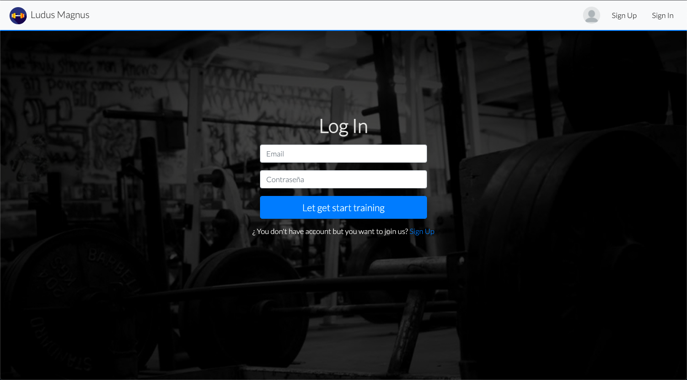
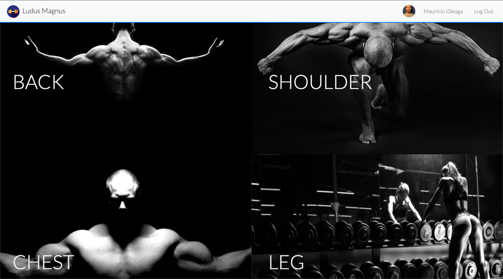
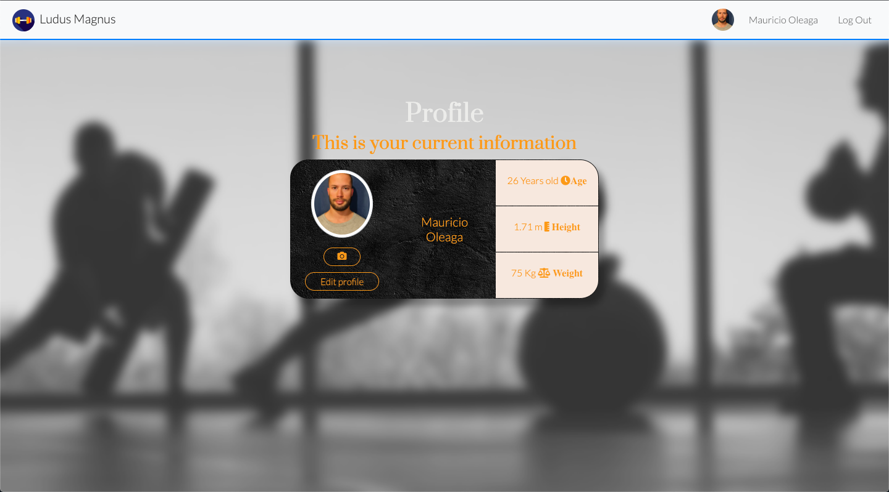

# Ludus Magnus GYM 

Ludus Magnus is a page designed with the purpose of encouraging and instructing the user through videos of exercise routines by experienced teachers, in which the user will have a profile section in which they can view their progress regarding their weight and routines, save your favorite videos and in each video you will have the freedom to comment or ask questions to teachers or other users about the exercises.

In the muscles section you can choose between the following; Biceps, Triceps, Abdominal, Back, Shoulder, Chest, Leg and Yoga. Once you have selected the muscle, you can choose what type of exercises you want to exercise; With machines, dumbbells or freestyle and additional, you will have the freedom to choose the difficulty according to how you feel prepared.











##Get Started


The first thing to do is open the terminal of your code editor of your choice and once there you will have to make sure to enter the folder called "gym", to enter it you must write "cd gym".

```sh
   cd ..
   cd gym
````

To continue we will divide the following steps into 2 sections, npm ui and npm api;


###API

In this folder is our Backend, once we enter and execute the following command it will only run the code on the side of the BackEnd. To get started in the user interface section, you will need to type the following command;

```sh
   cd api
   npm run dev
````

###UI

In this folder is our FrontEnd, therefore once the following command is executed, it will only run the code on the frontEnd side.To get start in the ui section you will have to write the following command;

```sh
   cd ui
   npm run start
````
After completing these steps, now you will be able to use the page normally, for that you have to open your browser and write the following in the URL;
http://localhost:3000/


## UI

Built with React, react-dom, react-moment, react-player, react-redux, react-router-dom, react-scripts, react-scroll, redux, redux-form, redux-thunk, axios, enzyme, enzyme-adapter-react-16, fs, moment, multer, node-sass, prop-types, save, uuid. 


## API

Built with Node, Express, mongo, morgan, multer, nodemon, mongoose, bcrypt, bcrypt-nodejs, body-parser, cors, fs, jwt-simple, passport, passport-jwt, passport-local.
